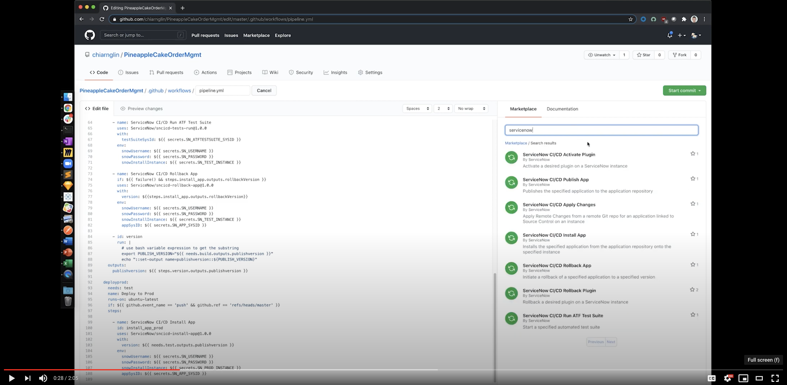

# Starter Workflows for ServiceNow CI/CD using GitHub Actions

These are the workflow files for helping people get started with GitHub Actions when building applications on the Now Platform.

Just copy and paste into your pipeline once your workflow is created for your application's linked GitHub repo. 

## Intro

This extension provides Build Steps for setting up Continuous Integration (CI) or Continuous Delivery (CD) workflows using GitHub Actions and workflows for developing applications on the [Now Platform from ServiceNow](https://www.servicenow.com/now-platform.html). **Click on the below screenshot to see a video for how you can use this extension to get started faster.**

The Build Steps are API wrappers for the [CI/CD APIs](https://developer.servicenow.com/dev.do#!/reference/api/paris/rest/cicd-api) first released with Orlando, and do not cover other ServiceNow APIs. They will currently work with the Orlando and Paris releases. 

Please reference our [open-source GitHub repo](https://github.com/jenkinsci/servicenow-cicd-plugin) for the implementation, as well as to submit any Issues or Pull Requests. For bug reports, see [bugs](https://issues.jenkins-ci.org/issues/?filter=22440) or [all open issues](https://issues.jenkins-ci.org/issues/?filter=22441). For documentation, see [official plugin site](https://plugins.jenkins.io/servicenow-cicd). For an example pipeline yml file, please copy from one of the existing [templates](examples/). 

## Usage

### Prerequisites

1. you will need a GitHub repo, a Jenkins box, and a new Jenkins multibranch pipelines project. To set up your own Jenkins box, you can follow the [Docker image setup instructions at the Jenkins site](https://www.jenkins.io/doc/book/installing/docker/), running on compute such as [AWS EC2](https://aws.amazon.com/ec2/). To create a new Jenkins project, just click on New Item on the main page 

### Quick Setup Guide

1. [Link to Source Control](https://developer.servicenow.com/dev.do#!/learn/learning-plans/paris/new_to_servicenow/app_store_learnv2_devenvironment_paris_linking_an_application_to_source_control) for an application that has been created on your instance. You'll find the link in Azure Repos for your new project on Azure DevOps.  
2. On your master branch, you should see a blue "Set up build" button in Azure Repos. Click on it to create your pipeline yml file. Copy paste the [template](https://github.com/ServiceNow/servicenow-cicd-azure-extension/blob/master/examples/pipeline.yaml), and change your environment variables to match your application's `sys_id`, ATF Test Suite `sys_id`, etc. On the first time, you can commit and save to the master branch without running the pipeline yet. 
3. In Project Settings, look for the [`Service Connections` section](https://docs.microsoft.com/en-us/azure/devops/pipelines/library/service-endpoints?view=azure-devops&tabs=yaml) under "Pipelines". Create a new service connection of "ServiceNow CI/CD" type. You will need your instance URL, credentials for a service account, and note the name you're creating the Service Connection under. 
4. In Repos > Branches, for your master branch, set up a [branch policy](https://docs.microsoft.com/en-us/azure/devops/repos/git/branch-policies-overview?view=azure-devops#:~:text=Branch%20policies%20are%20an%20important,can%20contribute%20to%20specific%20branches) with an automatic trigger and make it required if this fits your workflow. 
5. Back on the pipeline, make sure to change the `connectedServiceName` parameters for the individual Tasks to match your new Service Connections. 
6. You should now be able to create a new feature branch off master branch on your instance, develop features/fixes, commit to Source Control, create a PR, and your CI build will run automatically. Once our CI build passes and your PR is completed and feature branch merged to master, your CD build to deploy the application to production should trigger as well. 

### Other Notes

Tasks are all named starting with the **ServiceNow CI/CD** substring for easier organization and search filtering, and can be added via both the classic editor as well as the YAML editor in Azure DevOps. 

Some Tasks can produce output variables that are consumed as input for other Tasks. For example, the `Publish Application` Task generates a variable `publishVersion` that contains the version number for a recently published app. The `Install Application` Task can then consume this variable and produce a `rollbackVersion` variable that indicates the previous version of that app on the target instance, providing a mechanism for rolling back the application in `Rollback Application`. 

## API docs

The extension's Azure Pipelines Tasks are wrappers for the CI/CD APIs released as a part of Orlando, and will currently work through the Paris release. For more information, please see the ServiceNow [REST API documentation](https://developer.servicenow.com/dev.do#!/reference/api/orlando/rest/cicd-api). Tasks and APIs are not necessarily 1:1 matches; for example, the `ServiceNow CI/CD Start Test Suite` Task will trigger an ATF Test Suite run, get the progress, and when progress reaches 100%, will return the Test Suite result. 

## Marketplace

- https://github.com/marketplace/actions/servicenow-ci-cd-apply-changes
- https://github.com/marketplace/actions/servicenow-ci-cd-install-app
- https://github.com/marketplace/actions/servicenow-ci-cd-publish-app
- https://github.com/marketplace/actions/servicenow-ci-cd-rollback-app
- https://github.com/marketplace/actions/servicenow-ci-cd-run-atf-test-suite
- https://github.com/marketplace/actions/servicenow-ci-cd-activate-plugin
- https://github.com/marketplace/actions/servicenow-ci-cd-rollback-plugin

## Repos
- https://github.com/ServiceNow/sncicd-apply-changes
- https://github.com/ServiceNow/sncicd-install-app
- https://github.com/ServiceNow/sncicd-publish-app
- https://github.com/ServiceNow/sncicd-rollback-app
- https://github.com/ServiceNow/sncicd-tests-run
- https://github.com/ServiceNow/sncicd-plugin-activate
- https://github.com/ServiceNow/sncicd-plugin-rollback

## Support Model

ServiceNow built this integration with the intent to help customers get started faster in adopting CI/CD APIs for DevOps workflows, but __will not be providing formal support__. This integration is therefore considered "use at your own risk", and will rely on the open-source community to help drive fixes and feature enhancements via Issues. Occasionally, ServiceNow may choose to contribute to the open-source project to help address the highest priority Issues, and will do our best to keep the integrations updated with the latest API changes shipped with family releases. This is a good opportunity for our customers and community developers to step up and help drive iteration and improvement on these open-source integrations for everyone's benefit. 

## Governance Model

Initially, ServiceNow product management and engineering representatives will own governance of these integrations to ensure consistency with roadmap direction. In the longer term, we hope that contributors from customers and our community developers will help to guide prioritization and maintenance of these integrations. At that point, this governance model can be updated to reflect a broader pool of contributors and maintainers. 
